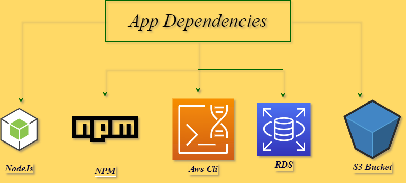

### Dependencies:

- Node v14.15.0
- npm 6.14.8
- AWS CLI v2
- A RDS database running Postgres
- A S3 bucket for hosting the frontend.
  

### aws urls of the project:

1. aws s3 bucket url :
   http://randombucket135898.s3-website-us-east-1.amazonaws.com/
2. database postgres host:
   mydb2.cqdodlstlmmv.us-east-1.rds.amazonaws.com
3. Elastic beanstalk url:
   https://Api-env.eba-cypwy9cp.us-east-1.elasticbeanstalk.com
