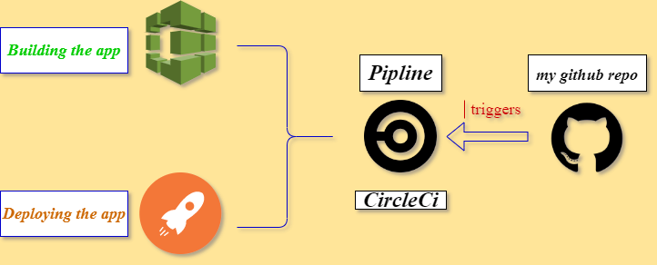

# Pipeline process:

1. orbs include installing node, aws and aws-cli
2. jobs: includes

   1. building the frontend and backend and installing dependencies of the application
   2. deploying the backend firstly then deploying the frontend

3. the workflow of the pipeline is firstly building the application then there is holding step which needs to get approved manually from the console, then the last step is deploying both the frontend and backend.

