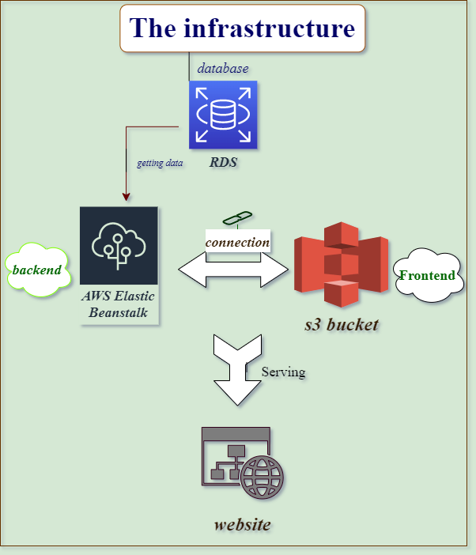

## The app is accessible via the link:

http://randombucket135898.s3-website-us-east-1.amazonaws.com/

### aws urls of the project:

1. aws s3 bucket url :
   http://randombucket135898.s3-website-us-east-1.amazonaws.com/
2. database postgres host:
   mydb2.cqdodlstlmmv.us-east-1.rds.amazonaws.com
3. Elastic beanstalk url:
   https://Api-env.eba-cypwy9cp.us-east-1.elasticbeanstalk.com

### Infrastructure of the project:



the project consists of two apps

1. udagram-frontend:
   responsible for hosting the the project,

2. udagram-api:
   the backend of the project, and provides services of the website (eg. User registration).
   and it connects to the database.

### Dependencies:

- Node v14.15.0
- npm 6.14.8
- AWS CLI v2
- A RDS database running Postgres
- A S3 bucket for hosting the frontend.

# Pipeline process:


1. orbs include installing node, aws and aws-cli
2. jobs: includes

   1. building the frontend and backend and installing dependencies of the application
   2. deploying the backend firstly then deploying the frontend

3. the workflow of the pipeline is firstly building the application then there is holding step which needs to get approved manually from the console, then the last step is deploying both the frontend and backend.

### Steps I have done To run the app:

1. I created the database (mydb2)
2. variables changed in EB
3. in package.json inside udagram-api:

```
   "engines": {
   "npm": ">=7.0.0",
   "node": ">=16.0.0"
   }
```

4. Iam keys (AWS_ACCESS_KEY_ID, AWS_SECRET_ACCESS_KEY)created and used it in the configuration of pipeline.
